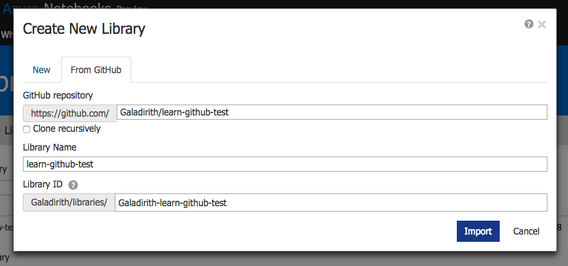
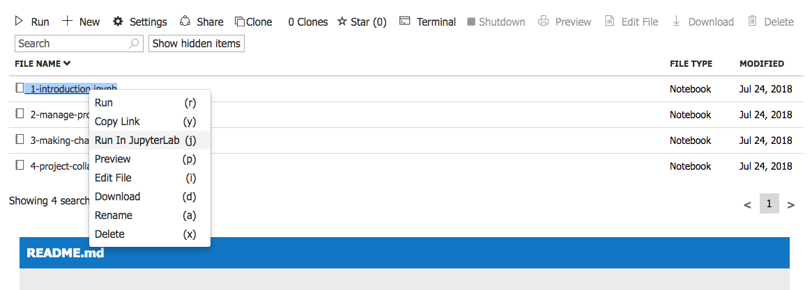

# Learn GitHub
*with Jupyter Notebooks*

[][azure]
[][binder]
[][slides]

## Setting up

In this workshop we will learn some common ways of interacting with Git and
GitHub.

To follow along with this interactive workshop you will need a free
[Microsoft account](https://account.microsoft.com/account) and a free
[GitHub account](https://github.com/join). You can follow the links to create
these accounts now, or you can create them when they are needed during the
workshop.

You can also find a set of accompanying Google Slides at
[][slides].

## Getting started

To start the workshop you can use either Microsofts Azure or MyBinder.
Microsoft Azure is the preferred way as notebook 4 cannot be followed on
MyBinder.

- **Microsoft Azure** [][azure]  

  Click the link
  [][azure]. This
  will take you to a new webpage that will ask you to import the repository.
  Click the `Import` button. You will then be asked to sign in with you
  Microsoft account. If you haven't already created one then you can create one
  now. Once you have logged in you will see a new window `Create New Library`.

  

  You can leave all of the setting as their defaults. Press `Import`. Once
  the import has finished click on the link `learn-github`. Finally right
  click on the file `1-introduction.ipynb` and press `Run In JupyterLab (j)`.

  

- **MyBinder** [][binder]

  Click the link [][binder]. This will
  automatically take you to a webpage where your interactive environment will
  be created and the `1-introduction.ipynb` will be opened for you.

## Acknowledgements

This workshop was inspired by the fantastic
[`git-it-electron`](https://github.com/jlord/git-it-electron) created by
[Jessica Lord](https://github.com/jlord) and built on a previous tutorial
presented by [Duncan Macleod](https://github.com/duncanmmacleod).

## I've completed this workshop 🎉

- [Edward Fauchon-Jones](https://github.com/Galadirith)

## License

`learn-github` is released under the [MIT license][license].

[license]: LICENSE.md
[azure]: https://notebooks.azure.com/import/gh/Galadirith/learn-github
[binder]: https://mybinder.org/v2/gh/Galadirith/learn-github/master?urlpath=lab/tree/learn-github/1-introduction.ipynb
[slides]: https://docs.google.com/presentation/d/1meylnPgFfxCvg-oaSqz9ob8IWs7yB8BKH3INQEa7MbQ/edit?usp=sharing
